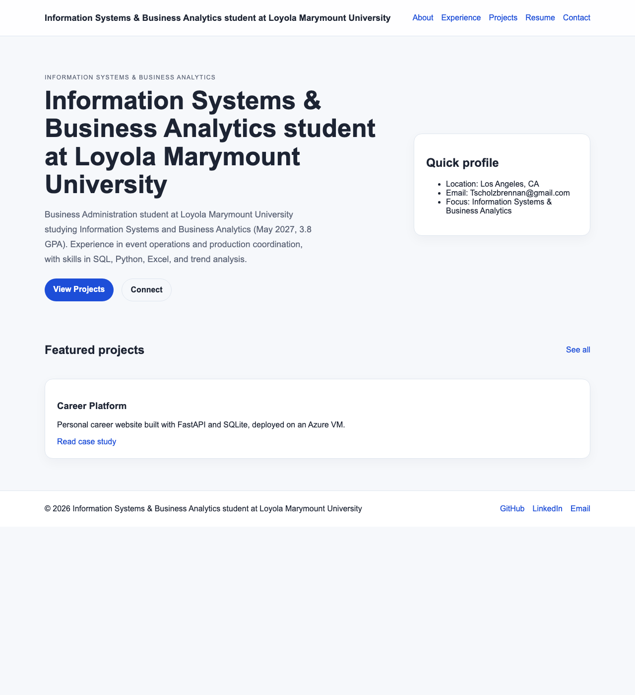

# Exercise 3 Evidence: Azure VM Migration

## 1. The VM

| Item | Value |
|---|---|
| Name | `vm-career-platform` |
| Resource group | `rg-career-platform` |
| Region | North Central US (`northcentralus`) |
| Size | `Standard_B2ats_v2` |
| Public IP | `20.221.247.215` (static) |
| OS | Ubuntu 24.04.4 LTS |

## 2. The site running on the VM

Taken 2026-09-29 from `http://20.221.247.215:8000/` while port 8000 was open in the VM's network security group.

The screenshot was taken by Claude Code in a headless Chrome which hides the address bar, but the image is from 20.221.247.215:8000.

## 3. What went wrong, how I investigated, and what confirmed the fix

The first issue I ran into was selecting the correct region for my VM the one that worked for me is, as seen above, North Central US. 

**A. SSH to the VM timed out (Server step 2)**

- Symptom: `ssh ... azureuser@<ip>` → "connect to host ... port 22: Operation timed out".
- The reason this happened is simple the VM was not actively running and the wrong IP was being used. so in order to fix this I prompted Claude Code to use the Azure CLI to start the VM and use the correct IP.
- Fix: `az vm start`, then used the VM's IP.
- Confirmed: ssh printed "connected", "azureuser", and "Ubuntu 24.04.4 LTS".

**B. Python version mismatch (laptop 3.14 vs VM 3.12.3)**

There was a python version mismatch. My devices uses 3.14 while the VM uses 3.12. There was a conflict with pydantic because the agent thought the project pins an older version of pydantic. the agent pinned Python 3.12 without asking me first. it told me afterwards which is not a huge problem for something small like this but for a different problem it can be detrimental if the agent does not check with me first.

- Confirmed: on the VM, uv used the system CPython 3.12.3, and fastapi 0.115.0 imported.
- Confirmed: `uv run python -m pytest -q` → 10 passed, on both the laptop and the VM.

**C. Starting uvicorn in the background over SSH hung the SSH command**

- The site started but the SSH command that launched it never finished.
- the agent checked from a second connection whether the site was actually running
- The agent closed the original connection, reconnected, and the site was still running.

Note: Many of the problems the agent presented to me had been background processes that it had troubleshooted without my input. I tried to include the ones that seemed to have a major impact on the migration.

## 4. The change

At the coffee shop I would have a different public IP than I would have at school same thing with any other location. There is no rule in Azure allowing that IP to have access to the VM. In order to fix this there are two ways, I could go to the Azure website and make a new network rule allowing me to connect or I could have an agent do it through the Azure CLI.

## 5. Note on the missing implementation plan

One of my Plan files is missing I am not sure why I don't have the Implementation plan, but I don't. It's not saved locally either the agent confirmed with me that it was never created.

- Spec: 9849413 on 9/15 added the site design spec, and 5e1e030 the same evening added the degraded-mode fallback to it.
- Code: 8828f4f on 9/17 built the whole site in one commit, co-authored with Copilot, and it was merged the same night (f3d9803).
- No plan: no commit on any branch contains a plan for building the site. The only plan file is the migration plan, first committed on 9/29 (27fae04).
